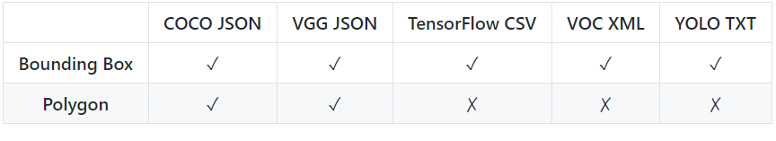

<!-- do a long readme -->
<p align="center"> 
    
    <!--      -->
    <!--      -->
</p>

## 描述：

MyVision 是一个免费的基于计算机视觉的ML训练数据在线图像生成工具。它的设计考虑到了用户使用感受，提供了加快标记过程功能并帮助维护具有大型数据集的工作流。

## 特征：

绘制边界框和多边形来标记您的对象：
<p align="center">
    
</p>

在多边形操作中丰富了编辑、删除和添加新点的附加功能：

<p align="center">
    
</p>

支持以下数据集格式：

<p align="center">
        
</p>

注释对象可能是一项艰巨的任务......您可以跳过所有艰苦的工作，并使用预先编程好的机器学习模型为您自动注释对象。 MyVision 充分利用了前沿“COCO-SSD”模型为您的图像生成边界框，并在您的本地浏览器上进行操作 - 将所有隐私数据保留在您计算机范围内：

<p align="center">
    
</p>

您可以导入现有的注释项目并继续在 MyVision 中使用它们。此过程还可用于将数据集从一种格式转换为另一种格式：

<p align="center">
    
</p>

## 语言

MyVision 适用于[英](./README.md)[中文](./README.cn.md)两种版本

## 本地设置
<!-- link to the file or bring the screen up to there -->
运行此项目无需设置，打开 [index.html](public/index.html) 文件，一切就绪！但是，如果您想对此数据库进行更改或完善，请按照以下说明进行操作：

```
# 要求：Node 版本 10+ 和 NPM 版本 6+

# 安装 Node 依赖项：
$ npm install

# 项目需在监视模式下运行：
$ npm run watch

# 所有更改都应在 src 目录中进行，并在 publicDev 中观察
```

## 引文
```
@MISC{MyVision,
   author = {Ovidijus Parsiunas},
   title = {{MyVision}},
   howpublished = {\url{https://github.com/OvidijusParsiunas/myvision}},
   year = {2019},
}
```