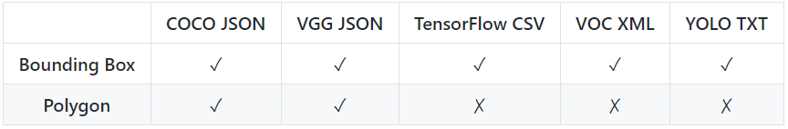

<p align="center"> 
        
    <!--      -->
</p>

## Description

MyVision is a free online image annotation tool used for generating computer vision based ML training data. It is designed with the user in mind, offering features to speed up the labelling process and help maintain workflows with large datasets.

## Features

Draw bounding boxes and polygons to label your objects:
<p align="center">
    
</p>

Polygon manipulation is enriched with additional features to edit, remove and add new points:

<p align="center"> 
    
</p>

Supported dataset formats:

<p align="center"> 
        
</p>

<br />
<br />
Annotating objects can be a difficult task... You can skip all the hard work and use a pre-trained machine learning model to automatically annotate the objects for you. MyVision leverages the popular 'COCO-SSD' model to generate bounding boxes for your images and by operating locally on your browser - retain all data within the privacy of your computer:

<p align="center"> 
    
</p>

You can import existing annotation projects and continue working on them in MyVision. This process can also be used to convert datasets from one format to another:

<p align="center"> 
    
</p>

## Local setup

No setup is required to run this project! However, if you want to make changes or contribute to this repository, please follow the instructions below:

```
# Requirements: Node version 8+ and NPM version 6+

# Install node dependencies:
$ npm install

# Run the project in watch mode:
$ npm run watch
```